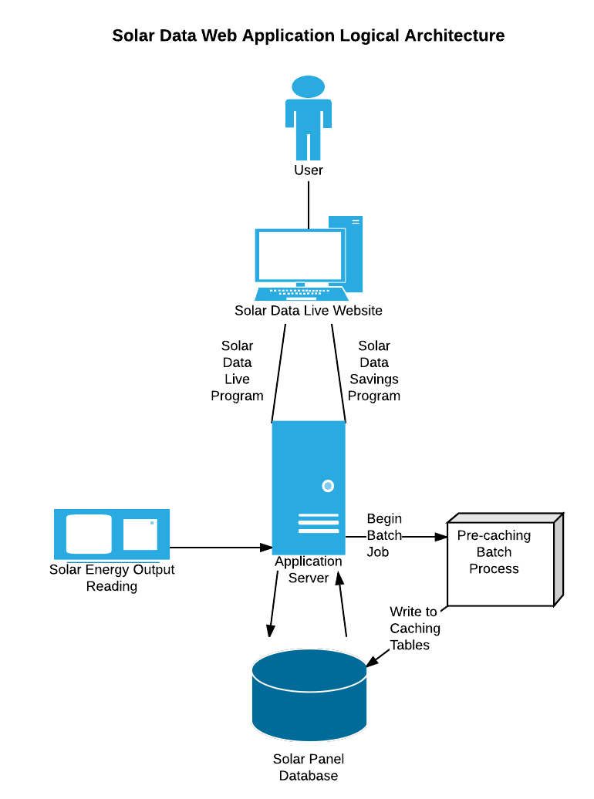

# Software Architecture Document    Solar Data Project   
  

# Table of Contents  
1. [Introduction](#1-introduction)  
   1.1 [Purpose](#11-purpose)  
   1.2 [Scope](#12-scope)  
   1.3 [Definitions](#13-definitions)  
   1.4 [References](#14-references)  
   1.5 [Overview](#15-overview)  
2. [Architectural Goals and Constraints](#2-architectural-goals-and-constraints)  
   2.1 [Technical Platform](#21-technical-platform)  
   2.2 [Security](#22-security)  
   2.3 [Persistence](#23-persistence)  
   2.4 [Reliability and Availability](#24-reliability-and-availability)  
   2.5 [Performance](#25-performance)  
3. [Logical Architecture View](#3-logical-architecture-view)  
4. [Data Model View](#4-data-model-view)  
5. [Activity View](#5-activity-view)  
6. [Pre-Caching Statechart](#6-pre-caching-statechart-view)  
7. [UI Mockup](#7-ui-mockup)  
 

## 1. Introduction  

### 1.1 Purpose  
This Software Architecture Document serves to provide a thorough technical specification for the project aimed at 
designing a system to calculate savings for solar panels installed at MVNU mission locations in Belize.  
 
The document should include sufficient definition of the system such that all components of the system are 
necessarily represented.  

### 1.2 Scope  
The scope of this document is to describe the architecture of the system that will augment the Solar Data Live
website, Solar Data Savings. 

### 1.3 Definitions  
___________________

### 1.4 References  
[Node.js](https://nodejs.org/en/)  
[Express framework](http://expressjs.com/)  
[Twitter Bootstrap](http://getbootstrap.com/)  

### 1.5 Overview  
___________________
 
	
## 2. Architectural Goals and Constraints  

### 2.1 Technical Platform  
The solar data project utilizes data stored in a MySQL database that is hosted on a Linux server also running a server program in Node.js. 
The user interface for this application will be a web page built with HTML5, Javascript, and Twitter Bootstrap. Batch jobs will also be
created on a job server to pre-cache data for use by the web application.    

### 2.2 Security  
Although no personal data is collected, measures will be taken to sanitize inputs to the system to prevent malicious access.
For information on Node.js security, [click here](https://nodejs.org/en/security/).  

### 2.3 Persistence  
Data will be persisted via a MySQL database. While the solar data being collected is supplied by existing hardware/software,
the schema will be expanded with additional tables ([see Data Model Diagram](#4-data-model-view)), including a table that stores pre-cached data.  

### 2.4 Reliability and Availability  
Reliability and availability are the responsibility of the owners of the existing website.  

### 2.5 Performance  
Solar data used to calculate savings will be pre-cached in the database by a job server to improve accessibility.  
 

## 3. Logical Architecture View  
The logical system architecture of the proposed system illustrates an integration with existing systems. Existing hardware and software are
being used to collect energy reading data from the solar panels. This data is persisted to an existing MySQL database that will be expanded
by this project. A new Node.js program to calculate monetary savings will run parallel to an existing PHP program used to display raw solar data. 
This information is rendered via HTML to the user. There is also a pre-caching batch job that will run regularly to write more accessible data to the
existing database.  
 
  
 

## 4. Data Model View  
Jeremy  

## 5. Activity View  
Nic  

## 6. Pre-Caching Statechart View  
Nic  

## 7. UI Mockup  
Jay  
