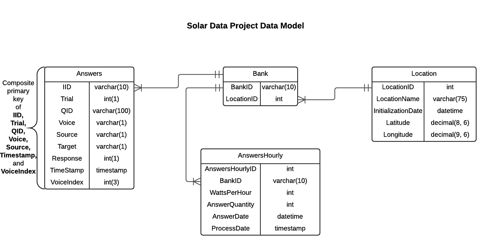

# Software Architecture Document    Solar Data Project   
  

# Table of Contents  
1. [Introduction](#1-introduction)  
   1.1 [Purpose](#11-purpose)  
   1.2 [Scope](#12-scope)  
   1.3 [Definitions](#13-definitions)  
   1.4 [References](#14-references)  
   1.5 [Overview](#15-overview)  
2. [Architectural Goals and Constraints](#2-architectural-goals-and-constraints)  
   2.1 [Technical Platform](#21-technical-platform)  
   2.2 [Security](#22-security)  
   2.3 [Persistence](#23-persistence)  
   2.4 [Reliability and Availability](#24-reliability-and-availability)  
   2.5 [Performance](#25-performance)  
3. [Logical Architecture View](#3-logical-architecture-view)  
4. [Data Model View](#4-data-model-view)  
5. [Activity View](#5-activity-view)  
6. [Pre-Caching Activity View](#6-pre-caching-activity-view)  
7. [UI Mockup](#7-ui-mockup)  
 

## 1. Introduction  

### 1.1 Purpose  
This Software Architecture Document serves to provide a thorough technical specification for the project aimed at 
designing a system to calculate savings for solar panels installed at MVNU mission locations in Belize.  
 
The document should include sufficient definition of the system such that all components of the system are 
necessarily represented.  

### 1.2 Scope  
The scope of this document is to describe the architecture of the system that will augment the Solar Data Live
website, Solar Data Savings.  

### 1.3 Definitions 
**Margin of Error:**  Margin of error is calculated based on available versus expected data.  In calculating energy saved the database could be 
missing readings for a variety of reasons.  This will have a negative effect on the accuracy of the calculated savings.  For instance, if 
there should be 100 readings in a time period, and there are only 97 in the database, this will result in a 3% margin of error. Because this 
margin of error results from missing data points, it is strictly positive, meaning that savings can only be higher than the listed output.  

### 1.4 References  
[Node.js](https://nodejs.org/en/)  
[Express framework](http://expressjs.com/)  
[Twitter Bootstrap](http://getbootstrap.com/)  

### 1.5 Overview  
**Section 2:** Outlines the architectural goals and constraints such as security, persistence, reliability, and performance.  
**Section 3:** Describes the logical architecture of the new system and old system post-integration.  
**Section 4:** Describes the data model of the system including new static tables and pre-caching tables.  
**Section 5:** Describes the activities that will occur between the user and the new system.  
**Section 6:** Describes the activities that will occur upon each run of the pre-caching job and its written result to the database.  
**Section 7:** Illustrates the user interface/interactions of the new system.  
 
	
## 2. Architectural Goals and Constraints  

### 2.1 Technical Platform  
The solar data project utilizes data stored in a MySQL database that is hosted on a Linux server also running a server program in Node.js. 
The user interface for this application will be a web page built with HTML5, Javascript, and Twitter Bootstrap. Batch jobs will also be
created on a job server to pre-cache data for use by the web application.  

### 2.2 Security  
Although no personal data is collected, measures will be taken to sanitize inputs to the system to prevent malicious access.
For information on Node.js security, [click here](https://nodejs.org/en/security/).  

### 2.3 Persistence  
Data will be persisted via a MySQL database. While the solar data being collected is supplied by existing hardware/software,
the schema will be expanded with additional tables ([see Data Model Diagram](#4-data-model-view)), including a table that stores pre-cached data.  

### 2.4 Reliability and Availability  
Reliability and availability are the responsibility of the owners of the existing website.  

### 2.5 Performance  
Solar data used to calculate savings will be pre-cached in the database by a job server to improve accessibility.  
 

## 3. Logical Architecture View  
The logical system architecture of the proposed system illustrates an integration with existing systems. Existing hardware and software are
being used to collect energy reading data from the solar panels. This data is persisted to an existing MySQL database that will be expanded
by this project. A new Node.js program to calculate monetary savings will run parallel to an existing PHP program used to display raw solar data. 
This information is rendered via HTML to the user. There will also be a pre-caching batch job that will run regularly to write more accessible data to the
existing database.  
 
  
 

## 4. Data Model View  
The new data model created by the project will include the existing table, as well as new tables to accommodate the proposed system. A Location table will be created
to store new information about each location such as the location name, latitude, longitude, and the date the site first began collecting data. To
create a link between this table and the original Answers table, a Bank table will be created which represents each bank of solar panels at the locations.
This table will have a foreign key to the Location table's LocationID (BankID in the bank table is the same as the IID in the Answers table). The AnswersHourly 
table will be added to store the results of the pre-caching job. This table will have the IID (bank), watts per hour, answer date (the date-time that 
represents the hour of the sum of watts per hour), and process date (the timestamp that the record was created by the batch job).  
 
  
 

## 5. Activity View  
The Activity diagram presents the various actions that will occur in the system. Upon arrival to the website, a user will provide inputs utilized by
the program for queries and calculations. If there are invalid inputs, the user will receive error messages and will then need to re-enter the information. 
If the inputs are valid, the program will use this information to perform a query of the data. If the result does not meet certain criteria (outlined in the User Stories),
an error message will be displayed to the user, indicating to them that they need to refine/change their inputs. If the result meets the outlined
criteria, then the system will perform the calculations needed to display the savings to the user.  
 
  
  

## 6. Pre-Caching Activity View  
The pre-caching process is a batch job that runs at the end of each day. It collects data for that day, separates it by bank and hour, totals the energy collected, 
and adds an collection entry for that date, bank, and hour to a table. Our program will then query this table and simply sum the results. This reduces the number 
of entries our program has to search to 1 entry for each 180 entries in the original data table.  
 

 

## 7. UI Mockup  
The default web page will display with the date radio button selected with the date fields and price per kilowatt inputs showing. The user will select a location 
and then enter the dates they wish to process as well as the cost they are basing this off of.  

If the date and hour radio is selected, the added time inputs will be displayed. The following view shows the added time fields and a sample of the output.  

